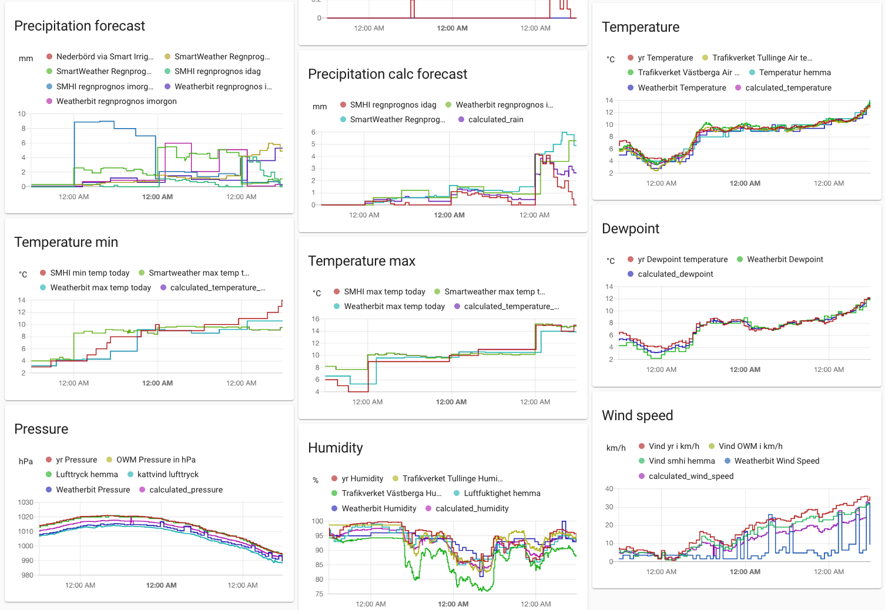
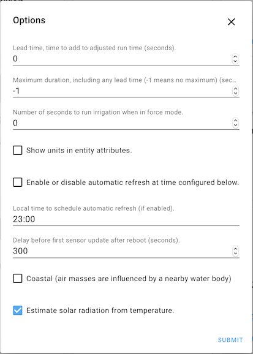

# Weather setup in Home Assistant

[![Buy me a coffee][buymeacoffee-shield]][buymeacoffee]

[buymeacoffee]: https://www.buymeacoffee.com/klec00
[buymeacoffee-shield]: https://www.buymeacoffee.com/assets/img/custom_images/orange_img.png

I use Home-Assistant to control many things in my home. One project I've spent much time on is the irrigation setup to control the [irrigation in my garden](https://github.com/klec00/ha-garden-irrigation). I do not have a weather station setup at my home (maybe a future project) so I instead rely on capturing weather data from various sources. I have learned over the years that these sources thends to be quite unreliable, so I therefore use a number of sources and then combine thme together into a set of sensors I need for my home automation. Pickin the mean value out of the range of sensors turns out to be reliable enough and prevents heavy distortion if one sensor goes crazy.

## Weather sources
- [SMHI](https://www.home-assistant.io/integrations/smhi/), the Swedish Meteorological and Hydrological Institute
- [weather_data](https://github.com/Danielhiversen/home_assistant_weather_data) integration of met.no, replacing old yr.no integration
- [Trafikverket Weather Station](https://www.home-assistant.io/integrations/trafikverket_weatherstation/), the national road administration publish sensor readings from their roadside weather stations
- [WeatherFlow Smart Weather Component](https://github.com/briis/smartweather) installed using [HACS](https://hacs.xyz/docs/configuration/start)
- Darksky via WeatherFlow Smart Weather Component, I'm using the older release that integrates with DarkSky. Newer releases leverage WeatherFlow instead. *todo: test new version*
- [OpenWeatherMap](https://www.home-assistant.io/integrations/openweathermap/)
- [Weatherbit](https://github.com/briis/weatherbit) installed using [HACS](https://hacs.xyz/docs/configuration/start)
- ESP8266 with DHT11 and Dallas sensors implemented using [esphome.io](https://esphome.io/components/sensor/dht.html).
- Hue motion sensors in my house with temperature sensors
- Alarm system has a temperature sensor in my kitchen as well

## Other integrations
- [Smart Irrigation](https://github.com/jeroenterheerdt/HAsmartirrigation)

## Sensors
The above listed sources are used to create a set of calculated sensors used in further automations and calculations in my Home-Assistant setup. Sensors marked with an asterisk `(*)` are used as input to the Smart Irrigation integration.

### Temperature
My implementation of temperature sensors is a bit of an overkill, so some day I may clean it up and go with fewer input sensors. For now it is working fine, so I don't want to touch it...
| Attribute | Description | Source |
| --- | --- | --- |
|`calculated_temperature (*)`|the mean temperature right now, calculated from a bunch of sensors |- met.no  - OpenWeathermap - Trafikverket road weather station in Tullinge - Trafikverket road weather station in Västberga - SMHI - Weatherbit|
|`calculated_temperature_min (*)`|Today's min temp observed so far|- SMHI SmartWeather Weatherbit|
|`calculated_temperature_max (*)`|Today's max temp observed so far|- SMHI SmartWeather Weatherbit|
|`calculated_max_temp_now`|Max of temperature sensors in the neighbourhood right now|- SMHI home temperature|
|`calculated_average_temp_yesterday`|Avg temp yesterday calculated from official temperature sensors in near proximity. Data becomes available around 06:00AM  |- SMHI average temperature yesterday from Tullinge - SMHI average temperature from Stockholm |
|`calculated_temperature_indoor`|mean of all indoor temp sensors -*not used for anything*|3xHue motion sensors ESP 8266 with DHT sensor Temp sensor on alarm system|

### Rain
Calculating rain turns out to be notoriously difficult, so some day I may invest in my own rain meter. For now, I make use of a range of sensors to estimate what the rainfall is so far today, what the expected rainfall is over the next 12-24 hours, and what was the actual rainfall in the neighbourhood yesterday.
| Attribute | Description | Source |
| --- | --- | --- |
|`calculated_rain (*)`|Mean of estimated rain today|- SMHI - Weatherbit|
|`calculated_max_rain_today`|Max forecasted rain over next 12-24 hours. Depends a bit on at what granularity the sources provide forecast data|- SMHI - SmartWeather|
|`calculated_average_rain_yesterday`|Average of official rainfall readouts from two nearby SMHI weather stations. Data becomes available next day around 6AM|- 2x REST sensors to read official SMHI data|

### Humidity
| Attribute | Description | Source |
| --- | --- | --- |
|`calculated_humidity (*)`|Mean humidity|- met.no - OpenWeatherMap - 2x Trafikverket - SMHI - Weatherbit|

### Pressure
| Attribute | Description | Source |
| --- | --- | --- |
|`calculated_pressure (*)`|Mean air pressure|- met.no - OpenWatherMap - SMHI - WeatherBit - ESP 8266 with DHT11 sensor|

### Wind Speed
Some sensors report wind speed in km/h but I need m/s for the SmartIrrigation component. I therefore expose two different sensors. 
| Attribute | Description | Source |
| --- | --- | --- |
|`calculated_wind_speed (*)`|Mean wind speed in km/h|- met.no - OpenWeatherMap - SMHI - WeatherBit|
|`calculated_wind_speed_mps`|Mean wind speed in m/s|- met.no - OpenWeatherMap - SMHI - WeatherBit|

### Dew point
| Attribute | Description | Source |
| --- | --- | --- |
|`calculated_dewpoint (*)`|Mean dew point|- met.no - Weatherbit|

### Evapotranspiration
Calculating the daily evapotranspiration is useful to decide how much I need to irrogate my garden. I tried many different methods before landed on the existing setup. In one attempt, I studied some research data from Swedish Meteorological and Hydrological Institute between 1968 - 1986, and then I built a least-square formula to estimate evapotranspiration out of measured temperature. This worked fine for some time, though the jinja2 template to do the calculation was pretty ugly. The downside with that approach was that it only took temperature into consideration, ignoring other important parameters like  humidity, air pressure etc.

I am currently using the excellent [Smart Irrigation](https://github.com/jeroenterheerdt/HAsmartirrigation) component to calculate the evapotranspiration. I am only interested in the evapotranspiration calculation, and have implemented my own calculations of waterbucket and irrigation time in my [Weather based Smart Irrigation setup in Home Assistant](https://github.com/klec00/ha-garden-irrigation) implementation.

The parameters for my Smart Irrigation setup are therefore very straight forward. For monthly evapotranspiration metrics, I found observed data for Sweden in the SMHI report [The "potential" evapotranspiration in Sweden](https://www.smhi.se/publikationer/den-potentiella-evapotranspirationen-i-sverige-1.7226). For the other Smart Irrigation parameters, the options are set as below:

